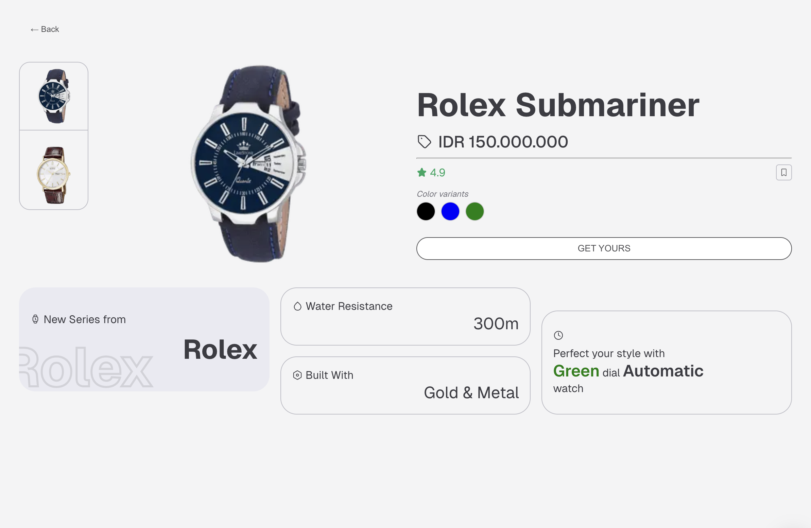

# Watch Catalogue

This is sample project using Nextjs v15 with Sass and deployed on Vercel

## Preview

<div style="display: flex; gap: 0.5rem; flex-wrap: wrap; justify-content:center">
  
  
  
</div>

## Setup project on local machine

This project is created with Nextjs v15 and `pnpm`, but if you're not using `pnpm`, `npm` should be sufficient.

### Run development server

```bash
pnpm dev
```

Then, open [http://localhost:3000](http://localhost:3000) with your browser to see the result. The application will automatically reload if you change any of the source files.

### Test

```bash
pnpm test
```

### Build

```bash
pnpm build
```
